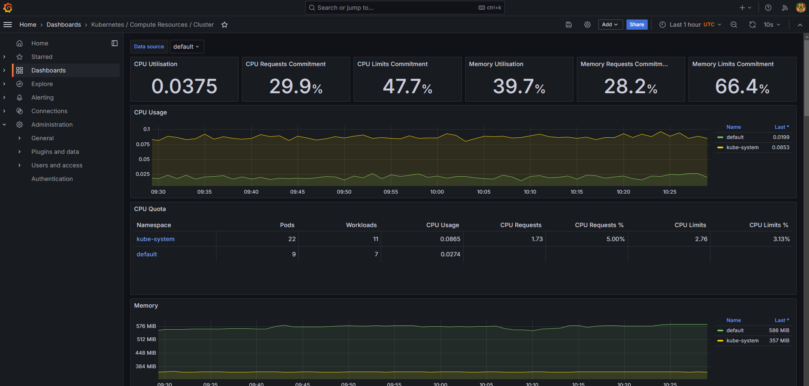
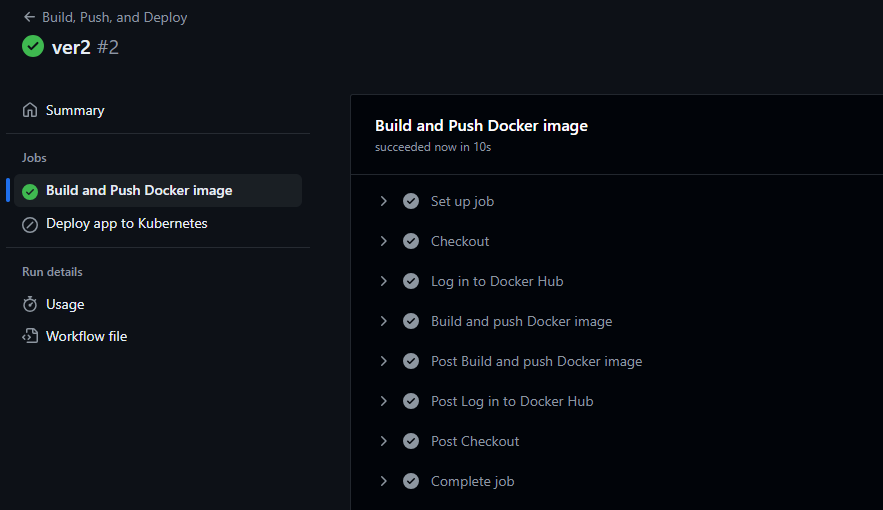

# Диплом Плотников В.Е.

# Дипломный практикум в Yandex.Cloud

* [Цели:](#цели)
* [Этапы выполнения:](#этапы-выполнения)
    * [Создание облачной инфраструктуры](#создание-облачной-инфраструктуры)
    * [Создание Kubernetes кластера](#создание-kubernetes-кластера)
    * [Создание тестового приложения](#создание-тестового-приложения)
    * [Подготовка cистемы мониторинга и деплой приложения](#подготовка-cистемы-мониторинга-и-деплой-приложения)
    * [Установка и настройка CI/CD](#установка-и-настройка-cicd)
* [Что необходимо для сдачи задания?](#что-необходимо-для-сдачи-задания)
* [Как правильно задавать вопросы дипломному руководителю?](#как-правильно-задавать-вопросы-дипломному-руководителю)

---
## Цели:

0. Настроим Linux для работы.
1. Подготовить облачную инфраструктуру на базе облачного провайдера Яндекс.Облако.
2. Запустить и сконфигурировать Kubernetes кластер.
3. Установить и настроить систему мониторинга.
4. Настроить и автоматизировать сборку тестового приложения с использованием Docker-контейнеров.
5. Настроить CI для автоматической сборки и тестирования.
6. Настроить CD для автоматического развёртывания приложения.

---
## Этапы выполнения:

<details><summary>Настроим Linux для работы</summary> 
Про VPN

По понятным причинам через RU IP работать неудобно, но я уже привык работать со своей Линукс машины.\
Поэтому для удобства вся работа будет через VPN, так я смогу работать со всеми продуктами хашикорпа без проблем.\
Так же мне будут доступны docker hub и другие сервисы.\
ВПН был поднят на арендованной машине забугром с помощью протокола wireguard, а в моем линукс просто настроен интерфейс.

Про Terraform

Для полной красоты обновлю терраформ до последней актуальной версии.


Про Yandex Cloud

Заодно обновлю и CLI яндекса.


Про ansible и прочее

Ansible не буду обновлять, так как довольно часто меняется синтаксис и я не очень хочу сейчас на изучение проблем связанных с этим тратить время.\
Python и другие инструменты пока тоже не буду трогать, так как мне еще не очевидно, что именно мне пригодится во всем проекте, может быть в процессе работы что-то еще дообновлю.
</details>

### <summary>Создание облачной инфраструктуры</summary>  
По задание в данном этапе нам необходимо:

1) Создать сервисный аккаунт и ключ шифрования
```terraform
# Создаем сервисный аккаунт
resource "yandex_iam_service_account" "sa" {
  folder_id = var.folder_id
  name      = "terraform-sa"
}

# Присваиваем роль редактора хранилища сервисному аккаунту
resource "yandex_resourcemanager_folder_iam_member" "sa-editor" {
  folder_id = var.folder_id
  role      = "storage.editor"
  member    = "serviceAccount:${yandex_iam_service_account.sa.id}"
}

# Создаем ключ для шифрования
resource "yandex_kms_symmetric_key" "encryption_key" {
  name              = "myencrypts"
  description       = "Ключ шифрования"
  default_algorithm = "AES_128"
  rotation_period   = "8760h"
}

# Создаем статический ключ доступа для сервисного аккаунта
resource "yandex_iam_service_account_static_access_key" "tf_service_key" {
  service_account_id = yandex_iam_service_account.sa.id
  description        = "Статический ключ"
}
```
2) Создаём бакет
```terraform
# Создаем бакет в объектном хранилище для хранения state tf
resource "yandex_storage_bucket" "storage_bucket" {
  access_key = yandex_iam_service_account_static_access_key.tf_service_key.access_key
  secret_key = yandex_iam_service_account_static_access_key.tf_service_key.secret_key
  bucket     = "loveyourvoice-state-bucket"
}
```
3) Создаем роль и наделяем сервисный аккаунт ею.
```terraform
# Определяем политику IAM для роли редактора хранилища
data "yandex_iam_policy" "storage_editor_policy" {
  binding {
    role = "storage.editor"

    members = [
      "userAccount:${yandex_iam_service_account.sa.id}",
    ]
  }
}

# Применяем политику IAM к сервисному аккаунту
resource "yandex_iam_service_account_iam_policy" "sa_editor_policy" {
  service_account_id = yandex_iam_service_account.sa.id
  policy_data        = data.yandex_iam_policy.storage_editor_policy.policy_data
}
```
4) Кладём в основную папку конфиг провайдера яндекс с настройкой для хранения state в бакете
```terraform
# Настраиваем провайдера через template
resource "local_file" "providers" { 
  content = templatefile("./template/providers.tftpl", {
    bucket_name = "loveyourvoice-state-bucket"
    access_key = yandex_iam_service_account_static_access_key.tf_service_key.access_key
    secret_key = yandex_iam_service_account_static_access_key.tf_service_key.secret_key
    cloud_id    = var.cloud_id
    folder_id   = var.folder_id
  })
  filename = "../providers.tf"
}
```
5) Результат:

6) Пишу манифест под VPC с подсетями в разных зонах.
```terraform
resource "yandex_vpc_network" "project_network" {
  name = var.network_name
}

resource "yandex_vpc_subnet" "project_subnet1" {
  name           = var.subnet_name1
  zone           = var.zone1
  network_id     = yandex_vpc_network.project_network.id
  v4_cidr_blocks = var.cidr1
}

resource "yandex_vpc_subnet" "project_subnet2" {
  name           = var.subnet_name2
  zone           = var.zone2
  network_id     = yandex_vpc_network.project_network.id
  v4_cidr_blocks = var.cidr2
}

variable "zone1" {
  type        = string
  default     = "ru-central1-a"
  description = "Зона для первой подсети"
}

variable "zone2" {
  type        = string
  default     = "ru-central1-b"
  description = "Зона для второй подсети"
}

variable "cidr1" {
  type        = list(string)
  default     = ["192.168.1.0/24"]
  description = "CIDR блоки для первой подсети"
}

variable "cidr2" {
  type        = list(string)
  default     = ["192.168.2.0/24"]
  description = "CIDR блоки для второй подсети"
}

variable "network_name" {
  type        = string
  default     = "project-network"
  description = "Имя VPC сети"
}

variable "subnet_name1" {
  type        = string
  default     = "project-subnet1"
  description = "Имя первой подсети"
}

variable "subnet_name2" {
  type        = string
  default     = "project-subnet2"
  description = "Имя второй подсети"
}
```
7) Возникли проблемы при apply, дело в версии tf, нужно было в провайдере обязательно добавить
```terraform
    skip_region_validation      = true
    skip_credentials_validation = true
    skip_requesting_account_id  = true
    skip_s3_checksum            = true 
```
иначе он настойчиво пытался применить s3 как AWS,а не yandex, поправил и template и сам файл providers.tf
8) Результат:


**Далее не буду в README выкладывать код, так как слишком огромный получится и читать будет неудобно.**
### <summary>Создание Kubernetes кластера</summary>
1) Создаю k8s кластер [k8s-cluster.tf](terraform%2Fk8s-cluster.tf)
2) Создаю сервисный аккаунт для кубера [k8s-acc.tf](terraform%2Fk8s-acc.tf)
3) Создаю группу нод для кубера [k8s-nodes.tf](terraform%2Fk8s-nodes.tf)
4) Сохраняю конфиг для подключения к кластеру [k8s-config.tf](terraform%2Fk8s-config.tf)
5) Делаю apply, apply прошел без ошибок, кластер и воркер ноды созданы, конфиг файл тоже, у сервисного аккаунта k8s минимум необходимых прав.

6) Проверил, дестрой выполняется без ошибок.

7) Проверяю подключение к кластеру через kubectl
```bash
kubectl get pods --all-namespaces
```


### <summary>Создание тестового приложения</summary>
1) Создал репо для приложения, подключил его к PHPStorm.

2) Создаю index.html, пишу простенький код, но с красивой анимацией текста, потому что, главная задача это эмуляция приложение, а не его разработка :)
```html
<!DOCTYPE html>
<html lang="ru">
<head>
    <meta charset="UTF-8">
    <meta name="viewport" content="width=device-width, initial-scale=1.0">
    <title>DIPLOM DEMO APP</title>
    <style>
        body {
            margin: 0;
            padding: 0;
            display: flex;
            justify-content: center;
            align-items: center;
            height: 100vh;
            background: linear-gradient(135deg, #1f1c2c, #928dab);
            color: #fff;
            font-family: 'Arial', sans-serif;
        }

        h1 {
            font-size: 4rem;
            text-transform: uppercase;
            letter-spacing: 0.5rem;
            text-shadow: 2px 2px 10px rgba(0, 0, 0, 0.4);
            animation: glow 1.5s ease-in-out infinite alternate;
        }

        @keyframes glow {
            from {
                text-shadow: 2px 2px 20px rgba(255, 255, 255, 0.5), 4px 4px 30px rgba(255, 255, 255, 0.4), 6px 6px 40px rgba(255, 255, 255, 0.3);
            }
            to {
                text-shadow: 2px 2px 20px rgba(255, 255, 255, 1), 4px 4px 30px rgba(255, 255, 255, 0.9), 6px 6px 40px rgba(255, 255, 255, 0.8);
            }
        }

        @media (max-width: 768px) {
            h1 {
                font-size: 2.5rem;
                letter-spacing: 0.3rem;
            }
        }

        @media (max-width: 480px) {
            h1 {
                font-size: 1.8rem;
                letter-spacing: 0.2rem;
            }
        }
    </style>
</head>
<body>
    <h1>DIPLOM DEMO APP</h1>
</body>
</html>
```

3) Ссылка на репо https://github.com/loveyourvoice/diplom_test_app
4) Пишу Dockerfile для дальнейшей сборки образа
```dockerfile
FROM nginx:latest
RUN rm -rf /usr/share/nginx/html/*
COPY index.html /usr/share/nginx/html/
EXPOSE 80
```
5) Делаю пуш в репо, чтобы склонировать со своего линукса, ведь там есть впн и я без труда смогу сделать пуш в докер хаб
6) Билжу и пушу образ в докер хаб
https://hub.docker.com/repository/docker/loveyourvoice/diplom-test-app


### <summary>Подготовка cистемы мониторинга и деплой приложения</summary>
1) Установил helm на свою машину

2) Используя helm добавляю репо с прометеусом и разворачиваю мониторинг 
```bash
helm repo add prometheus-community https://prometheus-community.github.io/helm-charts
helm repo update
helm install prometheus-stack  prometheus-community/kube-prometheus-stack
```

3) Создаю сервис LoadBalancer для графаны

Проверяю Яндекс 

**Сервис доступен по пути:**
**http://51.250.40.79:3000/login** \
   **_login: admin\
   password: prom-operator_**
4) Проверяю работоспособность дашбордов


4) Описываю деплой моего демо-приложения и сразу сервиса LB.


**Сервис доступен по пути:**
**http://51.250.42.206/**
5) Копирую файл для деплоя в репо с приложением
6) Добавляю необходимые секреты

7) Описываю [workflow](https://github.com/loveyourvoice/diplom_test_app/blob/master/.github/workflows/docker-build-and-deploy.yml)
8) Меняю в коде надпись на сайте и пушу

9) Делаю пуш, проверяю сборку образа и пуш в докер хаб

При этом редеплой пропущен, как и требует задание
10) Создаю новый тег проверяю, чтобы собирался образ, пушился и происходил редеплой.


11) Проверяю сайт, надпись изменилась
