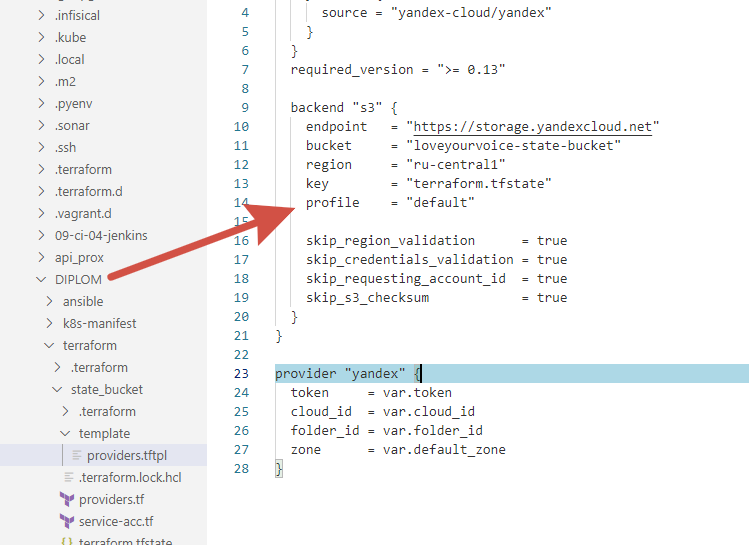
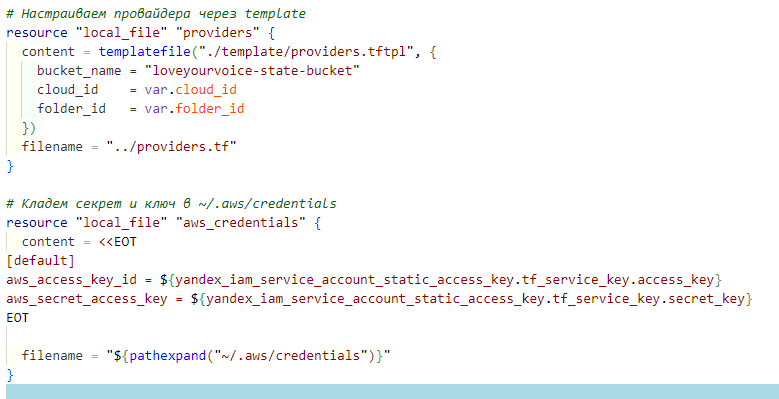
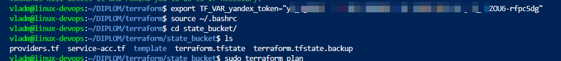
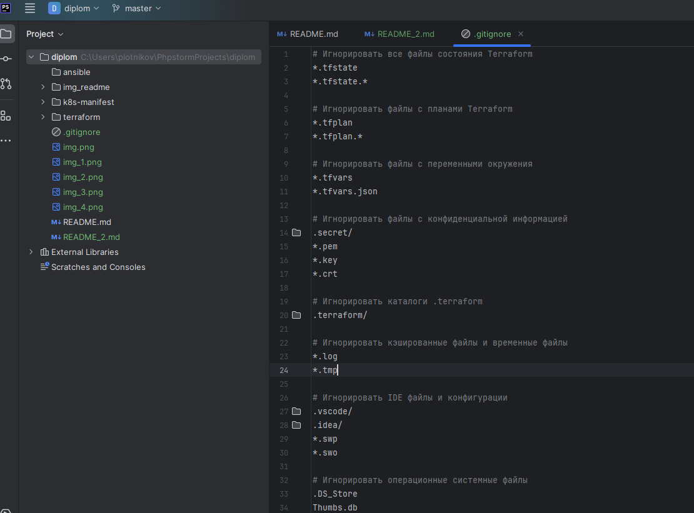
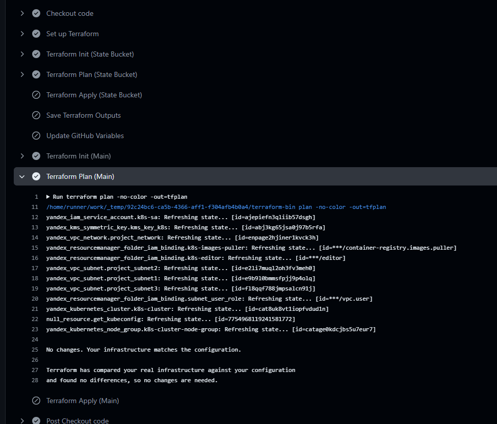

## Дорабатываю недочеты
### Недочёт №1 (Скрытие ключа для доступа к бакету)
1) Меняю шаблон который используется при создании бакета и создает в дальнейшем prodivers.tf в основной директории.
2) Так же меняю часть которая записывает секретные данные\


P.s. Этот способ работал локально, но для github action не подходит, поэтому я отказался от работы с профилями в пользу стандартных переменных типа: **AWS_ACCESS_KEY_ID** и тд


3) Далее просто изменил имя симметричного ключа, сделал terraform apply, удалился старый, создался новый, проверил, в ```/root/.aws/credentials``` записи успешно создались.


Повторюсь, данный способ подходит только локально, на момент исправления 4го недочета я изменил логику работы, можно посмотреть в файле [providers.tf](terraform%2Fstate_bucket%2Fproviders.tf), там отсутствуют данные переменные потому как используется станадратная переменная **AWS_ACCESS_KEY_ID** и **AWS_SECRET_ACCESS_KEY**
### Недочёт №2 (Скрытие токена yandex)
1) Отзываю токены все, по документации Яндекса можно использовать кнопку "Выйти со всех устройств", перепроверил, токен выпустился другой, все старые токены удалены.
2) Получаю новый токен
3) Удаляю default значения из файлов провайдеров и variables
4) Экспортирую новый токен в окружении линукс

5) Проверил, переменная работает, plan выполняется без ошибок.

### Недочёт №3 (Отсутствие файла .gitignore)
1) Написал файл, добавил в репо в корень.


### Недочёт №4 (Где ваша cicd ? atlantis или terraform cloud или terraform в ci-cd?)
Действительно, пропустил данный момент.
Добавил action в github, при любом пуше в мастер ветку отработает терраформ
Все секреты добавлены в секреты гитхаба, все отрабатывает без проблем.
Данный action отрабатывает по следующий схеме:
1) Проверяю в папке манифеста bucket state через команду terraform plan, нужен ли apply, если plan отвечает No Changes, то пропускаю apply бакета.
2) Аналогично проходит проверка основного манифеста.

3) Если создать новую папку в yandex cloud и поменять переменную FOLDER_ID в секретах, то отработает сначала код для создания бакета и обновление переменных ACCESS_KEY и SECRET_KEY в гитхаб репо, а следом исполнится основной манифест по созданию инфраструктуры.